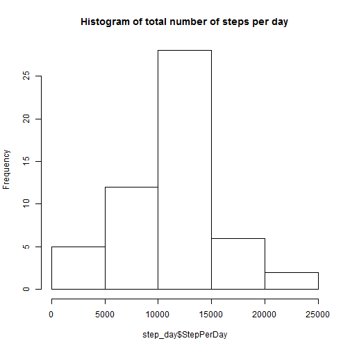
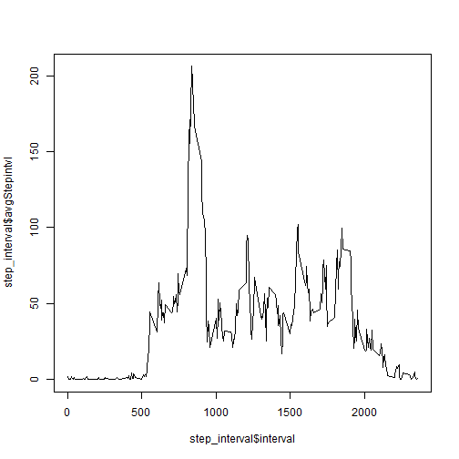

Title
========================================================
# Reproducible Research: Peer Assessment 1


=============================
## Loading and preprocessing the data

```r
# read datset
activity <- read.csv("activity.csv")
# count number of rows
nrow(activity)
```

```
## [1] 17568
```

```r
# identify rows with NA values
row_has_na <- apply(activity, 1, function(x) {
    any(is.na(x))
})
# count rows with NA values
sum(row_has_na)
```

```
## [1] 2304
```

```r
# filter out rows with NA value and create new datset Activity_complete
activity_complete <- activity[!row_has_na, ]
```

## What is mean total number of steps taken per day?

```r
# use sqldf package for grouping
library(sqldf)
```

```
## Warning: package 'sqldf' was built under R version 3.0.3
```

```
## Loading required package: gsubfn
```

```
## Warning: package 'gsubfn' was built under R version 3.0.3
```

```
## Loading required package: proto
## Loading required namespace: tcltk
## Loading required package: RSQLite
## Loading required package: DBI
## Loading required package: RSQLite.extfuns
```

```r
# total number of steps taken each day
step_day <- sqldf(" select date, sum(steps) 'StepPerDay' from activity_complete group by date")
```

```
## Loading required package: tcltk
```

```r
# Make a histogram of the total number of steps taken each day
hist(step_day$StepPerDay, main = "Histogram of total number of steps per day")
```

 

```r
# Calculate and report the mean and median total number of steps taken per
# day
```

## What is the average daily activity pattern?

```r
mean(step_day$StepPerDay)
```

```
## [1] 10766
```

```r
median(step_day$StepPerDay)
```

```
## [1] 10765
```

```r

# average number of steps taken, averaged across all days by interval
step_interval <- sqldf(" select interval, avg(steps) 'avgStepintvl' from activity_complete group by interval")

# Make a time series plot (i.e. type = 'l') of the 5-minute interval
# (x-axis) and the average number of steps taken, averaged across all days
# (y-axis)
plot(step_interval$interval, step_interval$avgStepintvl, type = "l")
```

 

```r

# Which 5-minute interval, on average across all the days in the dataset,
# contains the maximum number of steps?
sqldf("select interval, max(avgStepintvl) from step_interval")
```

```
##   interval max(avgStepintvl)
## 1      835             206.2
```

## Imputing missing values

```r
# create table with data having incomplete steps
activity_incomplete <- activity[row_has_na, ]

# use lookup table to assocuate incomplete values with avearge interval
# values
activity_inc_flld <- merge(activity_incomplete, step_interval, by.x = "interval", 
    by.y = "interval")

# drop step column
activity_inc_flld_2 <- activity_inc_flld[c(1, 3, 4)]

activity_inc_flld_3 <- step_interval <- sqldf(" select avgStepintvl 'steps', date, interval from activity_inc_flld_2")

# round to integer steps valie
activity_inc_flld_3[, c(1)] <- round(activity_inc_flld_3[, c(1)], 0)

# Create a new dataset that is equal to the original dataset but with the
# missing data filled in.
activity_total <- rbind(activity_complete, activity_inc_flld_3)
nrow(activity_total)
```

```
## [1] 17568
```

```r

# total number of steps taken each day
step_day_total <- sqldf(" select date, sum(steps) 'StepPerDay' from activity_total group by date ")
# Make a histogram of the total number of steps taken each day
hist(step_day_total$StepPerDay, main = "Histogram of filled total number of steps per day")
```

 

```r
# Calculate and report the mean and median total number of steps taken per
# day
mean(step_day_total$StepPerDay)
```

```
## [1] 10766
```

```r
median(step_day_total$StepPerDay)
```

```
## [1] 10762
```

## Are there differences in activity patterns between weekdays and weekends?

```r
# format date
new_date <- as.Date(activity_total$date, format = "%Y-%m-%d")
# separate between weekdays and weekend where weekend is true and weekdays
# false
new_date_2 <- weekdays(new_date) == "Sunday" | weekdays(new_date) == "Saturday"
activity_total_2 <- cbind(activity_total, new_date_2)
```

